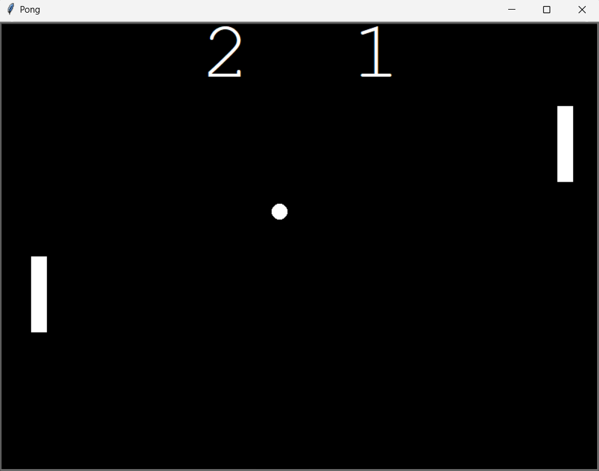

# 🕹️ Retro Pong Project  

Welcome to **Retro Pong**, a modern Python-based recreation of the legendary arcade game that pioneered competitive digital entertainment. This project brings back the nostalgic charm of the original Pong while leveraging clean, modular code design and object-oriented programming principles. With a structured codebase and polished gameplay mechanics, it serves as both a fun interactive experience and a showcase of Python game development practices.  

---

## 📖 Overview  

The **Retro Pong Project** is more than just a game—it is a carefully engineered implementation of one of the most iconic milestones in gaming history. This project demonstrates how timeless gameplay can be rebuilt using modern programming methodologies while still retaining its nostalgic feel.  

At its core, this project emphasizes:  
- **Object-Oriented Design (OOP):** Clear separation of responsibilities across multiple classes (`Ball`, `Paddle`, `Scoreboard`, and `Main Game Loop`).  
- **Code Reusability & Scalability:** Each module is designed to be independently modifiable, allowing future enhancements like AI-controlled paddles, power-ups, or multiplayer features.  
- **Readable & Maintainable Structure:** Ideal for students and developers looking to explore practical Python applications in game development.  

By encapsulating both simplicity and depth, Retro Pong bridges the gap between beginner-friendly coding exercises and professional programming practices.  

---

## 🛠️ Technologies & Concepts Used  

This project has been built with **Python** as the core language, enriched with modern libraries and programming paradigms to create a well-rounded game experience:  

- **Programming Language:** Python 3.x  
- **Graphics & Rendering:** `turtle` module for rendering shapes and movement.  
- **Game Loop Design:** Continuous event-driven loop to process real-time interactions.  
- **Object-Oriented Programming (OOP):**  
  - *Encapsulation:* Independent modules for the ball, paddles, and scoreboard.  
  - *Abstraction:* Simplified interactions between game objects without exposing internal logic.  
  - *Polymorphism & Inheritance (where applicable):* Flexible class design for scalability.  
- **Collision Detection:** Mathematical logic for paddle-ball interaction and boundary detection.  
- **Scoring & State Management:** Persistent game state updates displayed through a live scoreboard.  
- **Modularity & Code Organization:** Files separated by functionality (`main.py`, `ball.py`, `paddle.py`, `scoreboard.py`).  
- **Keyboard Event Handling:** Interactive controls allowing real-time gameplay.  

This combination not only strengthens the gameplay but also ensures the project doubles as a practical learning ground for fundamental computer science and software engineering concepts.  

---

## 🎮 Gameplay Mechanics  

Retro Pong encapsulates the essence of competitive two-player arcade fun while adhering to structured coding practices. The mechanics are designed to balance **simplicity** with **precision**:  

- **Two-Player Mode:** Each player controls one paddle.  
  - **Player 1 (Left Paddle):** Uses **W** (move up) and **S** (move down) keys to maneuver vertically.  
  - **Player 2 (Right Paddle):** Uses the **Up Arrow** (move up) and **Down Arrow** (move down) keys for vertical control.  
- **Ball Dynamics:**  
  - Moves at a constant speed, bouncing off top and bottom screen boundaries.  
  - Interacts with paddles using collision detection to change trajectory.  
  - Missed catches award a point to the opposing player.  
- **Scoring System:**  
  - Each successful pass beyond a paddle increments the opponent’s score.  
  - Live updates shown on the scoreboard in real-time.  
- **Progressive Difficulty (Optional Enhancements):** Ball velocity can be incrementally increased after each successful hit, enhancing competitive intensity.  
- **Victory Conditions:** The game can be played indefinitely or until a target score is reached (customizable).  

This careful balance of **responsive controls**, **predictable yet challenging physics**, and **real-time scorekeeping** ensures the gameplay feels polished, engaging, and reminiscent of the arcade era.  

---

## 📂 Project Structure

```
retro-pong-proj/
    ├── main.py         # Core game loop & orchestration
    ├── ball.py         # Ball class with movement & collision logic
    ├── paddle.py       # Paddle class with user controls
    ├── scoreboard.py   # Scoreboard class for real-time scoring
    ├── README.md       # Project documentation
    └── sample_output.png
```

---

### 🚀 How to Run

> ⚠️ Ensure you have **Python 3.10+** installed.

### Prerequisites
- Python 3.10 or above
- Compatible terminal or IDE (e.g., VS Code, PyCharm)

1. Install the required dependencies (if not already present):
   ```bash
   pip install turtle
   ```

2. **Clone the repository**
   ```bash
   git clone https://github.com/your-username/retro-pong-proj.git
   ```

3. **Navigate to the project folder**
   ```bash
   cd retro-pong-proj
   ```

> 💡 **Optional – Windows Only:** If you encounter errors related to `TCL_LIBRARY` or `TK_LIBRARY`, ensure that your Python installation's Tcl paths are correctly set using `os.environ` at the beginning of your script:
   ```bash
   import os
   os.environ['TCL_LIBRARY'] = r'C:\Program Files\Python313\tcl\tcl8.6'
   os.environ['TK_LIBRARY'] = r'C:\Program Files\Python313\tcl\tk8.6'
   ```

4. **Run the script**
   ```bash
   python main.py
   ```

---

## 🎨 Sample Output  

The **Retro Pong Project** brings back the nostalgic arcade feel with a clean and minimalistic design, executed entirely in Python using the `turtle` graphics module. The interface is intentionally kept lightweight to replicate the retro aesthetic while maintaining smooth gameplay mechanics.  

Below is a sample screenshot of the game in action:  

<p align="center">  
    
</p>  

### 🖼️ What You See in the Output:  
- **Classic Retro Arena** – A black background that mimics the old arcade display.  
- **Dynamic Ball Physics** – The ball accelerates with each paddle hit, making the game progressively challenging.  
- **Scoreboard on Top** – Cleanly displayed scores that update in real-time with each point.  
- **Two-Paddle Control** – Player 1 (left) and Player 2 (right) paddles controlled via keyboard input, designed for a competitive two-player experience.  

### ✨ Why It Stands Out:  
- Minimalist design that stays true to the original Pong legacy.  
- Smooth paddle movements and responsive collision detection.  
- Progressive difficulty ensures longer play sessions remain engaging.  

This output section highlights the game’s **simplicity, responsiveness, and nostalgic charm**, while offering a polished visual presentation for both users and contributors.  

---

## ✨ Key Highlights  

The **Retro Pong Project** is more than just a fun remake of a classic arcade game — it demonstrates structured programming, logical problem-solving, and creative application of Python’s features.  

---

### 🎮 Engaging Gameplay Mechanics  
- **Dynamic Ball Physics:**  
  The ball bounces realistically off paddles and walls, with precise collision detection ensuring smooth and fair gameplay.  
- **Progressive Difficulty:**  
  Each successful paddle hit slightly increases the ball’s speed, gradually raising the challenge level and preventing the match from feeling repetitive.  
- **Competitive Scoreboard:**  
  An integrated scoreboard tracks points in real-time, updating seamlessly as the game progresses. This adds a clear sense of competition and victory conditions.  
- **Balanced Design:**  
  Careful tuning of paddle speed and ball velocity ensures the game remains both accessible to beginners and challenging for advanced players.  

---

### 🛠️ Modular & Maintainable Code Structure  
- **Separation of Concerns:**  
  The project is divided into multiple files (`main.py`, `paddle.py`, `ball.py`, `scoreboard.py`) — each handling a specific aspect of the game.  
- **Object-Oriented Principles in Practice:**  
  - **Encapsulation:** Paddle, ball, and scoreboard each manage their own behaviors and properties.  
  - **Reusability:** Classes can be extended to add features like AI opponents or custom power-ups.  
  - **Readability:** The modular approach allows anyone reading the code to understand game flow at a glance.  
- **Scalable Foundation:**  
  The design supports easy integration of advanced features such as multiple balls, sound effects, or even multiplayer over a network.  

---

### 🚀 Skill Development & Learning Outcomes  
- **Reinforcing Python Fundamentals:**  
  Applying loops, conditionals, and functions in a structured, real-world project solidified core programming concepts.  
- **Mastering Game Loops & Event Handling:**  
  Learned how to implement continuous loops that track real-time events (keyboard inputs, object collisions) without freezing or lagging.  
- **Strengthening Logic-Building Skills:**  
  Designing paddle-ball interactions required step-by-step reasoning, including edge-case handling (e.g., corner collisions, missed paddle hits).  
- **Application of Coordinate Systems:**  
  Gained hands-on experience with x/y coordinates to control movement and positioning on the game screen.  
- **Problem-Solving Mindset:**  
  Encountered and overcame challenges such as synchronizing paddle controls, adjusting ball trajectory, and updating the scoreboard reliably.  

---

### 🌟 Beyond the Basics – Future Expansion Ideas  
- Introduce **AI-driven opponent paddles** for single-player mode.  
- Add **sound effects and animations** to enhance immersion.  
- Implement **power-ups** (e.g., larger paddles, faster ball) to diversify gameplay.  
- Extend into **multiplayer online play** using Python networking modules.  
- Create a **menu system with start/pause/reset options** for a more polished user experience.  

---

## 📜 Credits  

This project was developed as part of my learning journey through **"100 Days of Code: The Complete Python Pro Bootcamp" by Dr. Angela Yu**. The course provided the foundational knowledge and conceptual guidance for building the Pong game, while I worked on implementing the solution, organizing the architecture, and refining the mechanics to produce a polished, modular, and professional-grade final product.  

Additional refinements, such as **dynamic ball speed adjustments**, **modular file separation**, and **detailed README documentation**, were added to elevate both **gameplay experience** and **code maintainability**, transforming the project from a beginner exercise into a strong showcase of practical Python skills.  

Special acknowledgment to:  
- The **Python `turtle` graphics library**, for enabling accessible yet powerful graphical rendering.  
- The pioneers of **retro gaming** - **Atari & Allan Alcorn**, whose original Pong design inspired this modern re-implementation.  
